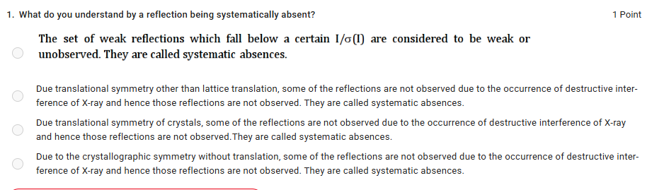

## Question 1

### What does “systematically absent” mean?

A reflection is **systematically absent** when its intensity is **exactly zero (ideally)** because of the **crystal's translational symmetry**, causing complete destructive interference for that particular set of Miller indices.

So this statement is closest:

> **“Due to translational symmetry other than lattice translation, some of the reflections are not observed due to destructive interference of X-rays. They are called systematic absences.”**

### Why the other statements are wrong

**1. “Weak reflections below a certain I/σ(I) are systematic absences.” ❌**

No. These are **weak/unobserved reflections**, not necessarily systematic absences.

For example, a reflection might be very weak because of:

* low scattering power,
* experimental noise,
* thermal motion,
* poor measurement,
* detector limitations.

A systematic absence is different: **symmetry requires that reflection to have zero intensity.**

---

**2. “Due to translational symmetry other than lattice translation...” ✅**

This is the best answer.

The important phrase is:

> **translational symmetry other than lattice translation**

This refers to symmetry elements such as:

* **screw axes**
* **glide planes**

These contain a fractional translation component.

For example, a screw axis can cause certain reflections to cancel:

$$
F(hkl)=0
$$

for particular \(h,k,l\) conditions.

---

**3. “Due translational symmetry of crystals...” ⚠️**

This is too broad and potentially misleading.

Ordinary **lattice translation** is fundamental to the definition of the reciprocal lattice and does not, by itself, create the characteristic systematic absences we're talking about here.

The key is **additional/fractional translational symmetry** associated with glide planes and screw axes.

---

**4. “Due to crystallographic symmetry without translation...” ❌**

Pure rotational symmetry, inversion, etc. **without a translation component** generally does not produce systematic absences in the same way.

The classic sources are **screw axes and glide planes**.

---

### The easiest way to remember it

Think:

**Systematic absence = symmetry says “this reflection must be zero.”**

And specifically:

**fractional translation → destructive interference → \(F=0\) → systematic absence**

The important distinction for your crystallography learning is:

| Situation                              | What happens?                   |
| -------------------------------------- | ------------------------------- |
| Reflection has low intensity           | Weak reflection                 |
| Reflection cannot be measured reliably | Unobserved reflection           |
| Symmetry forces intensity to zero      | **Systematic absence**          |
| Screw axis / glide plane               | Can produce systematic absences |
| Random experimental weakness           | **Not** a systematic absence    |
