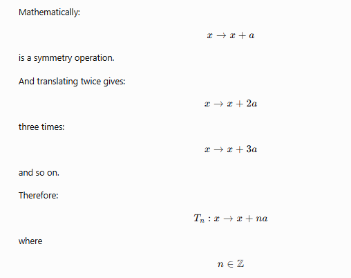
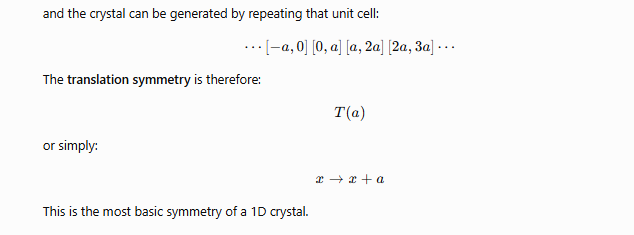

Absolutely. **1D symmetry** is a very good place to start before going into 2D/3D crystallographic symmetry, because it lets you understand the core idea of **symmetry operations, translations, symmetry elements, and groups** without the geometry becoming complicated.


# 1. First: what does "symmetry" actually mean?

Forget crystals for a moment.

Suppose I draw:

```text
● ● ● ● ● ● ● ●
```

If I move the entire pattern to the right by exactly one spacing, I get:

```text
    ● ● ● ● ● ● ● ●
```

The pattern is essentially unchanged.

That operation is called **translation**.

So, at its most fundamental level:

> **A symmetry operation is an operation that transforms an object into an indistinguishable configuration.**

The important word is **indistinguishable**.

It doesn't necessarily mean that every atom stays in the same place.

---

# 2. Why does 1D matter in crystallography?

A crystal is fundamentally a **periodic arrangement of matter**.

For example, imagine atoms arranged along a straight line:

```text
A — A — A — A — A — A — A
    ← a →
```

Here `a` is the distance between equivalent atoms.

If I translate the entire structure by `a`:

```text
Original:
A — A — A — A — A — A

After translation by a:
    A — A — A — A — A — A
```

the structure is indistinguishable from the original.



This is the fundamental idea behind **crystal periodicity**.

---

# 3. The simplest possible 1D crystal

Let's make an extremely simple crystal:

```text
A     A     A     A     A     A
|-----|-----|-----|-----|-----|
    a
```

The unit cell is:

```text
|-----|
   a
```



This is the most basic symmetry of a 1D crystal.

---

# 4. But there can be more than translation

Now consider:

```text
A — B — A — B — A — B — A — B
```

Suppose the distance between neighboring atoms is (a).

If I translate by (a):

```text
A — B — A — B — A
       ↓
B — A — B — A — B
```

That's **not** the same structure if A and B are chemically different.

But if I translate by (2a):

```text
A — B — A — B — A — B
          ↓

A — B — A — B — A — B
```

Now it matches.

So the fundamental translation period is:

$$
2a
$$

rather than (a).

This is an extremely important crystallographic idea:

> **The smallest translation that reproduces the entire structure determines the primitive repeat period.**

---

# 5. Now introduce reflection

Consider a 1D arrangement:

```text
A — B — C — B — A
```

There is a special point in the middle:

```text
A — B — C — B — A
        ↑
      center
```

If I reflect the structure through the center, I get the same arrangement.

In one dimension, reflection is:

$$
x\rightarrow -x
$$

if the reflection point is chosen as (x=0).

For example:

```text
x:    -3  -2  -1   0   1   2   3
      A   B   C    D   C   B   A
```

Reflection:

$$
x\rightarrow -x
$$

gives:

```text
x:     3   2   1   0  -1  -2  -3
       A   B   C   D   C   B   A
```

The arrangement is unchanged.

So **reflection is another possible 1D symmetry operation**.

---

# 6. What is the equivalent of a mirror plane in 1D?

This is where crystallography gets interesting.

In 3D we commonly talk about:

* mirror plane (m)
* inversion center ($\bar 1$)
* rotation axis
* screw axis
* glide plane
* translation

But in **1D**, there isn't enough dimensional freedom for all of these to exist in their ordinary 3D forms.

A 1D reflection can be thought of as a **point reflection about a particular location**:

$$
x\rightarrow -x
$$

It is mathematically the same transformation as **inversion in one dimension**.

That is why 1D is such a nice conceptual laboratory.

---

# 7. Translation + reflection is where things become really interesting

Suppose we have:

```text
... A B C | C B A | A B C ...
           ↑
        symmetry
```

We can have both:

$$
T: x\rightarrow x+a
$$

and

$$
M: x\rightarrow -x
$$

These operations can be combined.

For example:

$$
MT(x)=M(x+a)
$$

which gives:

$$
MT(x)=-(x+a)
$$

while

$$
TM(x)=T(-x)
$$

gives:

$$
TM(x)=-x+a
$$

So the order in which symmetry operations are performed can matter.

This is one of the first hints that we're entering the world of **group theory**.

---

# 8. What is a symmetry group?

Suppose we collect all operations that preserve our structure.

For a simple 1D periodic crystal, we might have:

$$
\ldots,T^{-2},T^{-1},E,T,T^2,T^3,\ldots
$$

where:

* (E) = do nothing
* (T) = translate by (a)
* (T^2) = translate by (2a)
* (T^{-1}) = translate by (-a)

These operations form a mathematical **group**.

The identity is:

$$
E:x\rightarrow x
$$

The inverse of (T) is:

$$
T^{-1}:x\rightarrow x-a
$$

because:

$$
T^{-1}T(x)=x
$$

This seemingly simple idea becomes extremely important in crystallography.

---

# 9. Why is translation so fundamental to crystals?

Because a crystal isn't just an object with some symmetry.

It has **long-range periodic order**.

Imagine:

```text
● ● ● ● ● ● ● ● ● ● ● ● ● ●
```

The crystal doesn't care which particular unit cell you call "cell 1."

You could label them:

```text
| cell 1 | cell 2 | cell 3 | cell 4 |
```

or:

```text
       | cell 1 | cell 2 | cell 3 | cell 4 |
```

The physical crystal is unchanged.

This means the crystal possesses **discrete translational symmetry**.

And this is the foundation of the **crystal lattice**.

---

# 10. Lattice vs motif

This distinction is crucial.

Consider:

```text
●     ●     ●     ●     ●
```

The repeating points form a **lattice**.

Now imagine each point carries a molecule:

```text
  H₂O       H₂O       H₂O       H₂O
   ↑         ↑         ↑         ↑
   ●---------●---------●---------●
```

The lattice tells you:

> **Where are the repeating positions?**

The motif tells you:

> **What is attached to each repeating position?**

Together:

$$
\boxed{\text{Crystal structure}=\text{Lattice}+\text{Motif}}
$$

This distinction will become extremely important when you study **space groups**.

---

# 11. Now consider a more interesting 1D structure

Suppose the motif itself has orientation:

```text
→   →   →   →   →   →
```

Translation by (a):

```text
    →   →   →   →   →
```

works.

But suppose:

```text
→   ←   →   ←   →   ←
```

Translation by one atomic spacing changes:

```text
→ ← → ← → ←
```

into:

```text
← → ← → ← →
```

So it doesn't reproduce the structure.

But translation by (2a) does.

Therefore the **symmetry period depends on the complete motif**, not merely the positions of points.

This is why crystallographers care about the actual atomic arrangement rather than just the lattice.

---

# 12. A subtle but important distinction: symmetry of an object vs symmetry of a lattice

Imagine:

```text
A       A       A       A
```

The lattice has translation (a).

Now replace the atoms with molecules that point alternately:

```text
↑       ↓       ↑       ↓
```

The underlying points still occur every (a).

But the **full structure** has a repeat of (2a).

So:

### Lattice periodicity

[
a
]

### Structural periodicity

[
2a
]

This distinction becomes much more sophisticated in real crystals, especially with:

* multiple atoms in a unit cell
* molecular orientations
* substitutions
* ordered/disordered structures
* modulated structures

---

# 13. What symmetry operations are possible in 1D?

At the simplest level, the important ones are:

### Identity

$$
x\rightarrow x
$$

Do nothing.

---

### Translation

$$
x\rightarrow x+a
$$

Move by one lattice period.

---

### Reflection/inversion

$$
x\rightarrow -x
$$

Reflect about a point.

---

### Translation + reflection

For example:

$$
x\rightarrow -x+a
$$

This can produce another symmetry center at a different position.

Repeated combinations of these operations generate the full symmetry of certain 1D periodic patterns.

---

# 14. An interesting result: reflection centers repeat

Suppose you have a reflection at (x=0):

$$
M_0(x)=-x
$$

and translation:

$$
T_a(x)=x+a
$$

You can generate another reflection.

Consider:

$$
T_a M_0 T_{-a}
$$

Applying this to (x):

$$
x\xrightarrow{T_{-a}}x-a
$$

then:

$$
x-a\xrightarrow{M_0}-(x-a)
$$

then:

$$
-(x-a)\xrightarrow{T_a}-x+2a
$$

Therefore:

$$
x\rightarrow 2a-x
$$

This is reflection about:

$$
x=a
$$

So if you have:

* translation symmetry (a)
* one reflection center

then the periodic structure automatically generates equivalent reflection centers throughout the crystal.

That's a beautiful connection between **local symmetry** and **periodicity**.

---

# 15. Now connect this to crystallography properly

In crystallography, we eventually move from:

### 1D

$$
x
$$

to

### 2D

$$
(x,y)
$$

and finally:

### 3D

$$
(x,y,z)
$$

In 3D, a translation becomes:

$$
\mathbf r\rightarrow \mathbf r+\mathbf t
$$
where:

$$
\mathbf t=u\mathbf a+v\mathbf b+w\mathbf c
$$

The 1D version is simply:

$$
x\rightarrow x+na
$$

So **1D translation symmetry is essentially the simplest possible version of the translational symmetry that produces a crystal lattice in 3D.**

---

# 16. Why this matters for unit cells

When you later encounter:

$$
\mathbf a,\mathbf b,\mathbf c
$$

in GSAS-II or crystallography textbooks, don't think of these initially as complicated crystallographic parameters.

Think:

```text
1D

●--------●--------●--------●
     a
```

Then:

```text
2D

●--------●--------●
|        |        |
|        |        |
●--------●--------●
|        |        |
|        |        |
●--------●--------●
```

Then:

```text
3D

        ●--------●
       /|       /|
      / |      / |
     ●--------●  |
     |  ●-----|--●
     | /      | /
     |/       |/
     ●--------●
```

The conceptual leap isn't as enormous as it initially appears.

---

# 17. The really important crystallographic idea

There are actually **two different things** you should keep separate in your head:

### Symmetry operation

An operation such as:

$$
x\rightarrow x+a
$$

or:

$$
x\rightarrow -x
$$

### Symmetry element

The geometric entity associated with the operation.

For example, in 3D:

| Operation   | Symmetry element   |
| ----------- | ------------------ |
| Reflection  | Mirror plane       |
| Rotation    | Rotation axis      |
| Inversion   | Inversion center   |
| Translation | Translation vector |

In 1D, the geometry becomes degenerate/simple, but the conceptual distinction is already there.

---

# 18. Why chemists care about this

Imagine a molecule in a crystal.

You determine that one molecule occupies:

[
(x,y,z)
]

But the crystal symmetry tells you that other equivalent molecules must exist at positions generated by symmetry operations.

For example:

[
(x,y,z)
]

might generate:

[
(x+1,y,z)
]

[
(x,y+1,z)
]

[
(x,y,z+1)
]

through lattice translations.

And additional symmetry operations can generate other equivalent positions.

Therefore, crystallography is partly asking:

> **Given a small amount of structural information, what other atomic positions are mathematically required by symmetry?**

That's why symmetry is so central to crystallography.

---

# 19. The hierarchy I recommend you learn

Since you're learning crystallography for GSAS-II and diffraction, I'd build symmetry in this order:

```text
1D
 │
 ├── Periodicity
 │
 ├── Translation
 │
 ├── Reflection / inversion
 │
 ├── Combining operations
 │
 └── Symmetry groups
 │
 ▼
2D
 │
 ├── Translation
 ├── Rotation
 ├── Reflection
 ├── Glide
 └── 2D plane groups
 │
 ▼
3D
 │
 ├── Translation
 ├── Rotation
 ├── Inversion
 ├── Reflection
 ├── Screw
 ├── Glide
 └── 3D space groups
 │
 ▼
Crystallographic structure
 │
 ├── Unit cell
 ├── Fractional coordinates
 ├── Wyckoff positions
 ├── Systematic absences
 └── Diffraction
```

And eventually this connects directly to what you've already been studying:

$$
\boxed{\text{Symmetry}\rightarrow\text{Structure}\rightarrow\text{Diffraction pattern}}
$$

---

## One mental model to keep

If you remember only one thing from 1D symmetry, remember this:

```text
             SYMMETRY
                │
                ▼
       "What can I do to
        the structure so
       it looks unchanged?"
                │
        ┌───────┴────────┐
        ▼                ▼
   Translation        Reflection
   x → x+a             x → -x
        │                │
        └───────┬────────┘
                ▼
       Allowed symmetry
          operations
                │
                ▼
        Symmetry group
                │
                ▼
       2D → 3D crystals
                │
                ▼
          Space groups
                │
                ▼
       Atomic positions
                │
                ▼
       Diffraction pattern
```

The key conceptual jump is that **symmetry isn't primarily about visual beauty or geometric shapes**. In crystallography, it is about **operations that leave the complete periodic atomic arrangement indistinguishable**.

And once you understand that, **2D plane groups and eventually 3D space groups become extensions of the same idea rather than a collection of names to memorize.**
