# Lessons/Topics

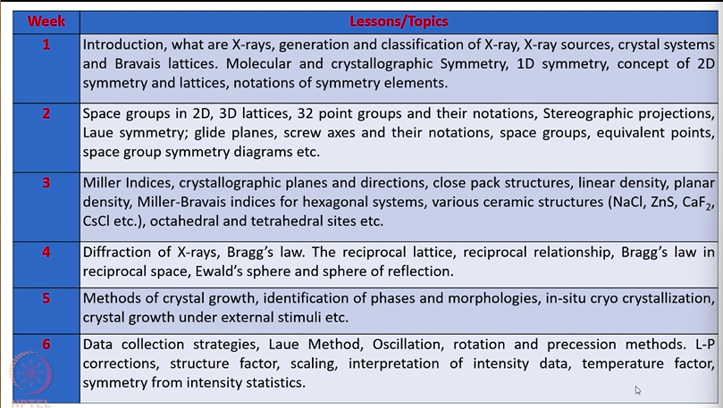

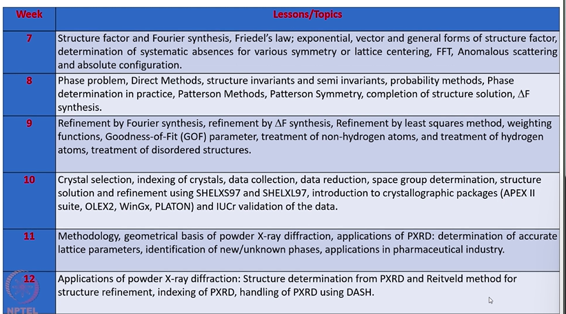

## Spectroscopy and Crystallography

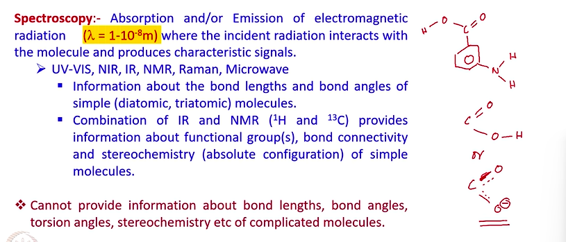

## Crystallography

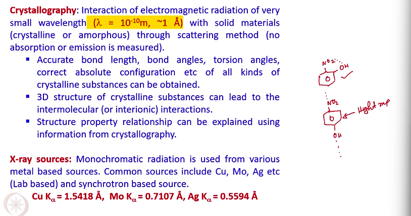

## Types of X-ray diffraction Experiments

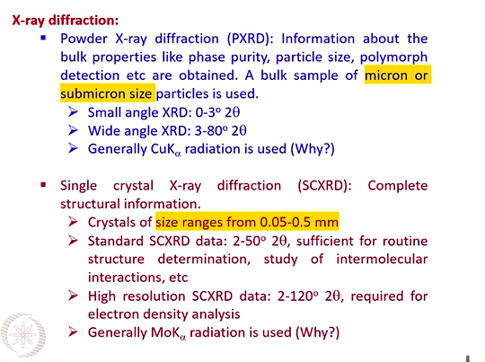

The particular experiment can be done at various temperatures. One can do data collection at room temperature 300 kelvin or we can do data collection at low temperature e.g. 100kelvin or 10 kelvin

* > The advantage of doing data collection at lower temperature is to reduce the thermal motion of atoms and moleules inside the lattice

## Generation of X-rays

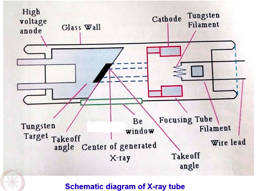

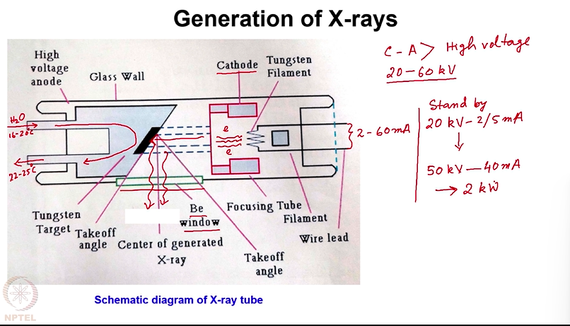

## Generation of Characteristics Radiation

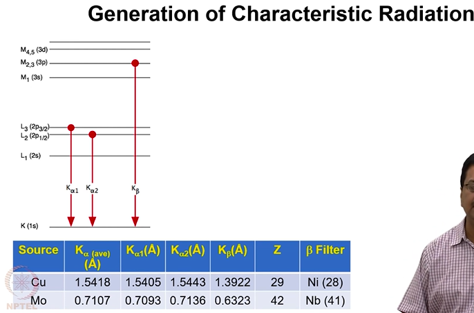

* We use Nickel and Niobium as filter

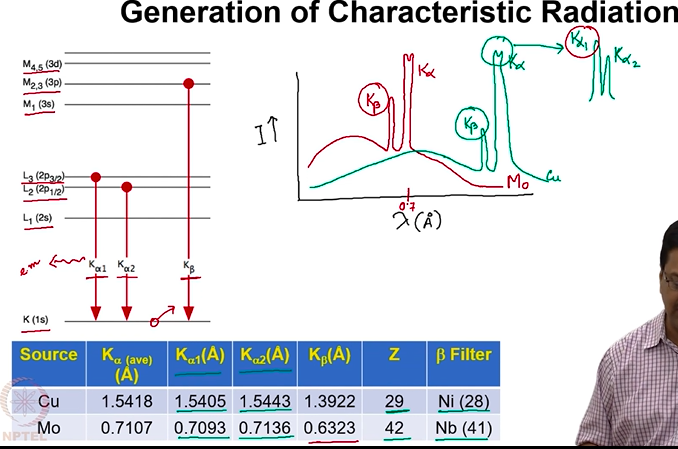

* Region of Braking Radiation

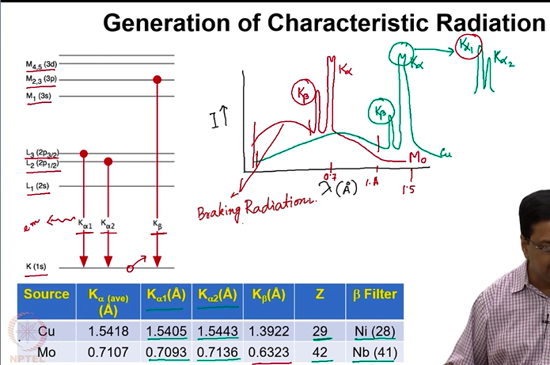

* Why we need to use higher voltage

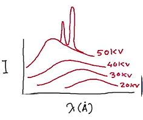

