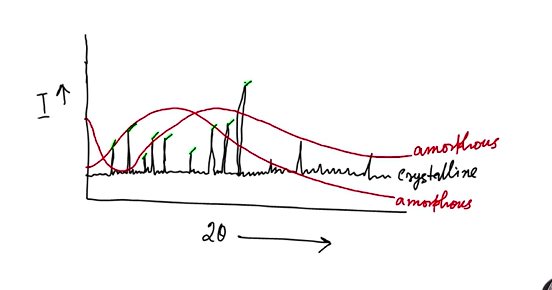
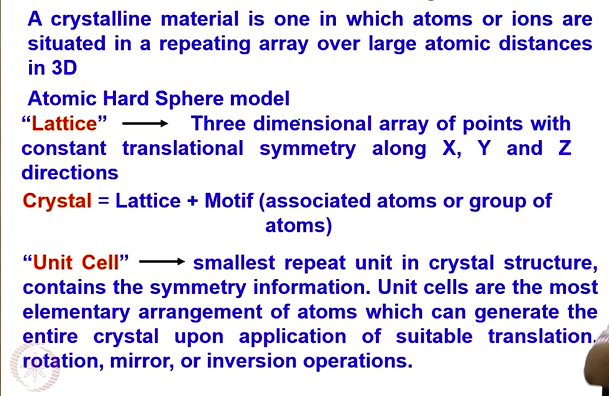
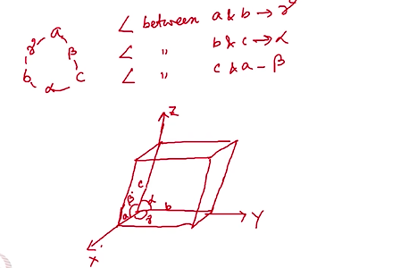
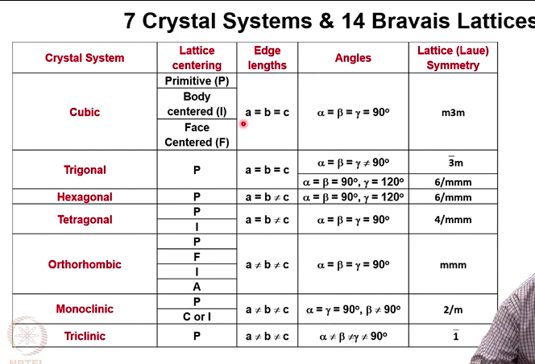
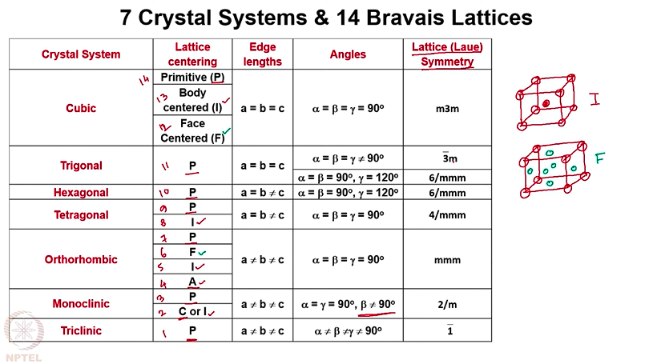
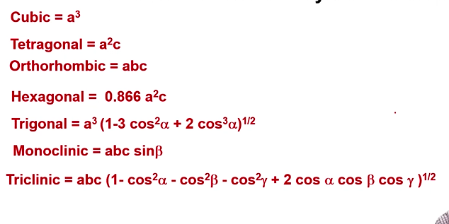

# Sources of X-Rays, Crystal Systems and Bravais lattices

## Synchrotron sources

> Synchrotron radiation is the electromagnetic radiation emitted when charged particles are subjected to an acceleration perpendicular to their velocity.

> This is produced by using bending magnets, undulators and/or wigglers when electrons are made to travel in a circular path under vacuum.

> The emission is called synchrotron emission, which may be achieved artificially in synchrotrons or storage rings, or naturally by fast electrons moving through magnetic fields.

> The radiation produced in this way has a characteristic polarization and the wavelengths generated can span over the entire electromagnetic spectrum.

## X-ray Diffraction : The beginning

## Crystalline vs Amorphous

## Topics to study in X-ray Diffraction

* Concepts about unit cell, crystal lattice and crystal systems in 1D, 2D and 3D

* Crystallographic symmetry elements and their
differences from the molecular symmetry
elements, crystallographic point groups and
space groups.

* Crystallographic planes, directions, and their
significance.

## What is Crystal?

## Crystal Systems

Crystals are grouped in terms of 6 parameters - a, b, c, $\alpha$, $\beta$, $\gamma$

Diagram for Primitive, Body centered and face centered

## Volumes of Different Crystal Structuress

