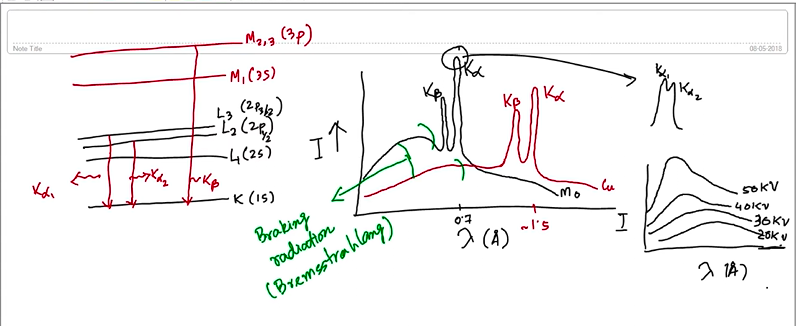
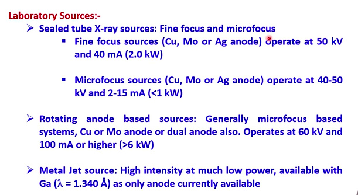
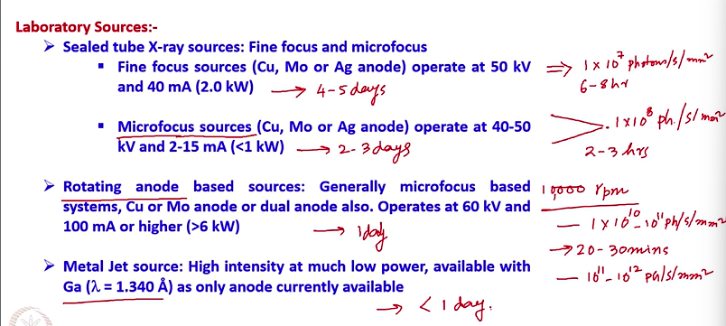
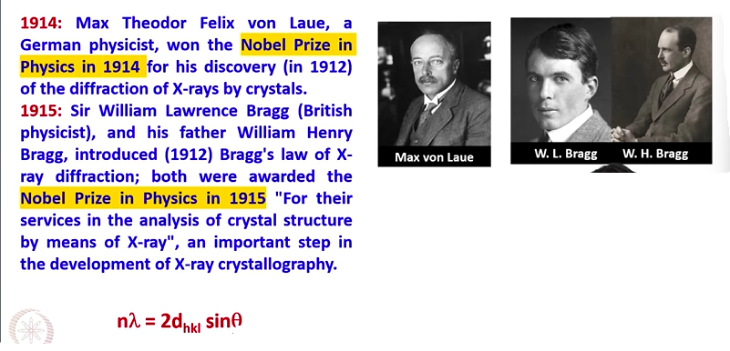

# Sources of X-Rays, Crystal Systems and Bravais lattices

## Synchrotron sources

> Synchrotron radiation is the electromagnetic radiation emitted when charged particles are subjected to an acceleration perpendicular to their velocity.

> This is produced by using bending magnets, undulators and/or wigglers when electrons are made to travel in a circular path under vacuum.

> The emission is called synchrotron emission, which may be achieved artificially in synchrotrons or storage rings, or naturally by fast electrons moving through magnetic fields.

> The radiation produced in this way has a characteristic polarization and the wavelengths generated can span over the entire electromagnetic spectrum.

## X-ray Diffraction : The beginning

