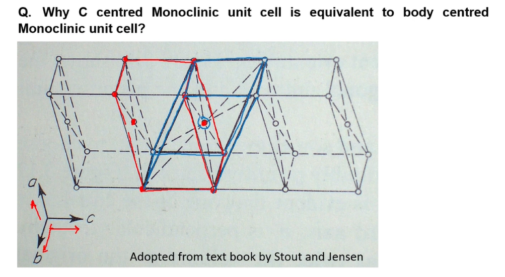
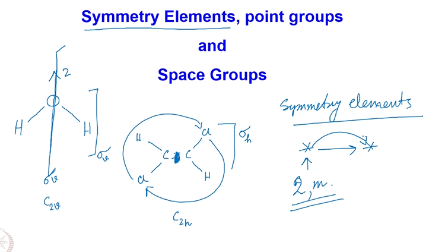
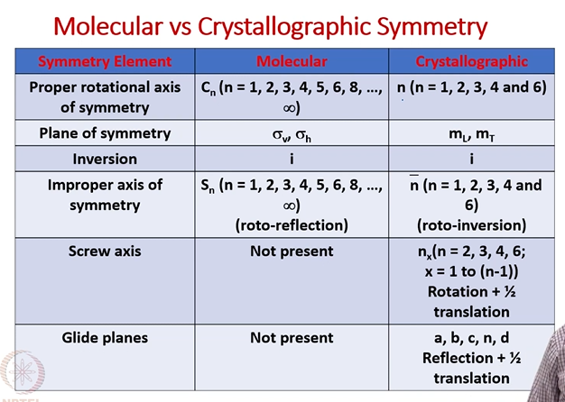
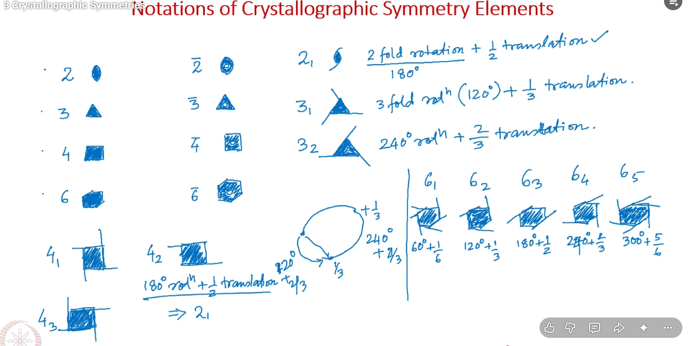
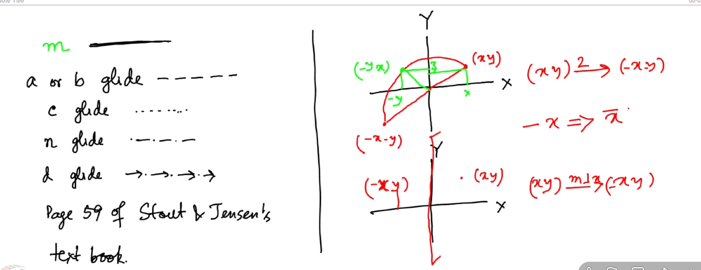

# 3 Crystallographic Symmetries

* Why face centered tetragonal system not one of the bravais lattices?

## Symmetry Elements, point groups and Space Groups

## Molecular vs Crystallographic Symmetry

## Notations of Crystallographic Symmetry Elements

