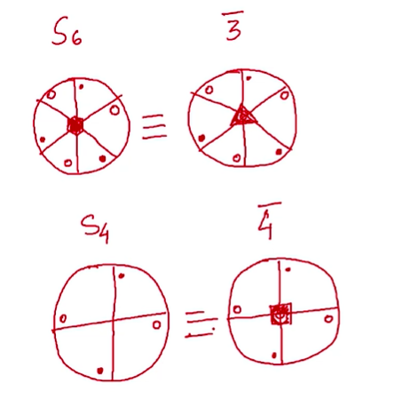
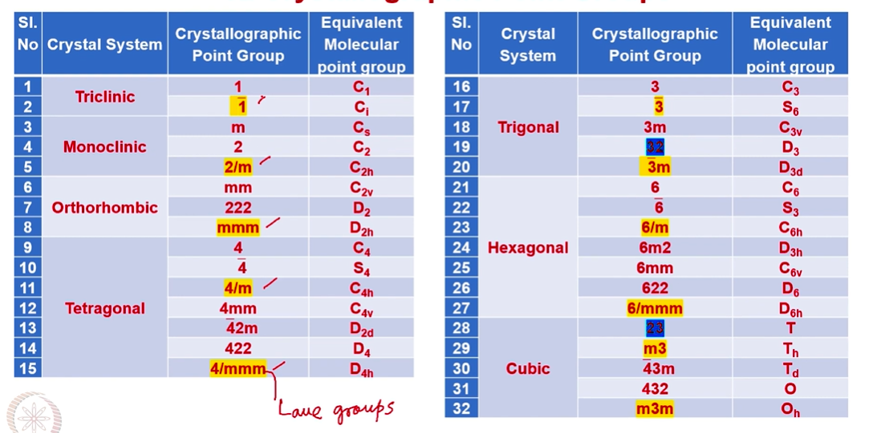

# 7 Crystallographic Point Groups

## 2D Lattices with symmetry : 2D space groups with symmetry notations only

Question - what is glide plane?

all of them contain mirror plan in different direction

## Roto-reflection(Sn) and roto-inversion ${\bar{n}}$ axis

## 32 Crystallographic Point Groups

